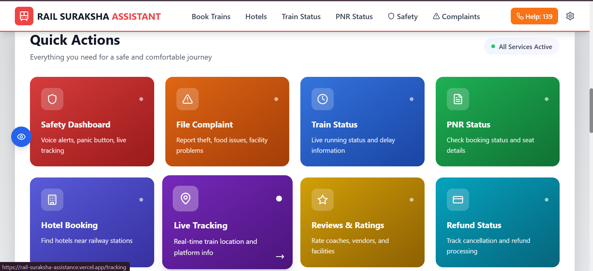

RAIL SURAKSHA ASSISTANCE 

Github repo :- https://github.com/Dev-Shannn/rail-suraksha-assistance

live link :- https://rail-suraksha-assistance.vercel.app/

404 error link :- https://rail-suraksha-assistance.vercel.app/coach-tracjsjsn

google drive link for demo video of website :- https://drive.google.com/drive/folders/1oK7gOV7ihrdYgLMpLsfJfRvqTvPcVLF7?usp=drive_link

🌟 Features

🟢 Easy Level
                 1.Creative 404 / Error Page
                 2.Custom-designed, thematic 404 page.
                 3.Simulates a "train has gone off track" metaphor.
                      
                          Example: Broken Route

                  

✅ Dark Mode Support

                1.Supports prefers-color-scheme (auto-detection).
                2.Manual toggle available for all users.

✅ Custom Loading States

                3.Railway-inspired loaders (e.g., “Train is approaching...”).
                4.Engaging animations that enhance realism.

🟡 Medium Level

🎨 Dynamic Theming

            1.Backgrounds and UI elements change with time of day.
            2.Built using JavaScript Date APIs.
            3.Expandable to use external APIs (e.g., weather-based themes).

🌐 Multilingual Support

            1.Google Translate works fine with this site 
            Supports English, Hindi, Bengali, and more.

📘 Story Mode (Virtual Guide)

            1.A voice command feature that let user send
            emergency situation with nearby police station 
            or local authorities in the area he/she is present

🔴 Hard Level

          1.🎙️ Voice Navigation & Accessibility
          Voice command support using Web Speech API.

         2.Colorblind-friendly mode and accessible UI components.
         with dark mode

🔊 Text-to-Speech (TTS)

         1.Real-time safety instructions via text-to-speech.
          Ideal for visually impaired users or travelers on the move.
          and it can be so helpful in case of emergency

🔁 Parallel Interaction Mode

         Emergency contacts or responders can view real-time safety alerts.

         Shared interface using Firebase/socket simulation.

         Enables collaborative response and safety tracking.

Here are some screenshots of our  website 

 TO START DEVELOPMENT

 1. npm i
 2. npm run dev

💡 Future Enhancements

          📍 Real-time geolocation tracking.

          🚨 SMS/WhatsApp alerts via Twilio.

          🧪 Testing suite for panic workflows.

👨‍💻 Built With  

        React.js, Tailwind CSS , Three.js 

        Firebase (for real-time interaction)

        supabase for backend

        Web Speech API 

        Google Translate

        Framer Motion, Lottie, and other UI libraries , 

